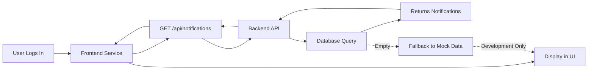

# 🔔 Notification System - Complete Fix Guide

## 🎯 Quick Answer

**Yes, the notification system has real backend endpoints** - it's NOT using dummy data. However, your database is likely **empty**, so the frontend falls back to mock data for demonstration purposes.

---

## 🚀 Quick Fix (2 Minutes)

### On Production Server (Linux - datasqan)

```bash
# SSH to server
ssh aidocumines@datasqan

# Navigate to project
cd ~/ecobserve  # or wherever your project is

# Run the seeding script
./scripts/seed_notifications.sh

# Verify it worked
./scripts/check_notifications.sh
```

### On Local Development (Mac)

```bash
cd ~/Documents/Github/eatier

# If Docker is running
./scripts/seed_notifications.sh

# Check status
./scripts/check_notifications.sh
```

**That's it!** 🎉 Now login with any of your 4 accounts and click the bell icon.

---

## 📋 What I Did

I analyzed your notification system and created:

### ✅ Analysis Documents
1. **`NOTIFICATION_SYSTEM_ANALYSIS.md`** - Complete technical analysis
2. **`NOTIFICATIONS_SETUP.md`** - Detailed setup and testing guide
3. **`NOTIFICATION_FIX_README.md`** (this file) - Quick reference

### ✅ Automation Scripts
1. **`scripts/seed_notifications.sh`** - Seeds notifications for all users
2. **`scripts/check_notifications.sh`** - Diagnostic tool
3. **`backend/scripts/seed_notifications.js`** - Node.js version (alternative)

---

## 🔍 System Architecture

### Backend (✅ Fully Working)

**Endpoints:**
- `GET /api/notifications` → Fetch user's notifications
- `PATCH /api/notifications/:id/read` → Mark as read
- `PATCH /api/notifications/read-all` → Mark all as read
- `DELETE /api/notifications/:id` → Delete notification

**Database Table:** `notifications`
```
├─ id (UUID)
├─ tenant_id (UUID) - Multi-tenancy
├─ user_id (UUID) - Recipient
├─ type (TEXT) - booking, review, message, etc.
├─ title (TEXT)
├─ message (TEXT)
├─ is_read (BOOLEAN)
├─ created_at (TIMESTAMP)
└─ data (JSONB) - Metadata (action URLs, etc.)
```

### Frontend (✅ Fully Working)

**Service:** `src/app/core/services/notification.service.ts`
- Calls real API endpoints
- Falls back to mock data if API is empty (for demo)
- Manages state with Angular signals

**UI:** Bell icon in header (top right corner)
- Shows unread count badge
- Dropdown panel with notifications
- Click to navigate to action page
- Mark as read / Delete actions

---

## 🧪 Testing All 4 Account Types

After running the seeding script, test with each account:

| Account Type | Test Credentials | What to Check |
|--------------|------------------|---------------|
| **Regular User** | Your user account | Bookings, payments, messages |
| **Business Owner** | Business owner account | Reviews, inquiries, bookings |
| **Specialist** | Specialist account | Appointments, client messages |
| **Admin** | Admin account | System notifications |

### Expected Result
- 6 notifications per account
- 3 unread (with blue dot/badge)
- 3 read (dimmed)
- Various types: 📅 booking, ⭐ review, 💬 message, ✅ payment, ℹ️ info, ⚠️ warning

---

## 🐛 Troubleshooting

### Problem: "No notifications showing"

**Diagnosis:**
```bash
./scripts/check_notifications.sh
```

**If says "0 notifications":**
```bash
./scripts/seed_notifications.sh
```

**If seeding fails:**
```bash
# Check if database is running
docker ps | grep postgres

# Check if table exists
docker exec itiyum-postgres psql -U itiyum_user -d itiyum_platform -c "\d notifications"

# If table doesn't exist, run migrations
./run_all_migrations.sh --docker
```

### Problem: "Still showing dummy data"

**Cause:** Frontend is falling back to mock data because:
1. Database has no notifications, OR
2. API is not accessible, OR
3. User is not authenticated

**Fix:**
1. Run seeding script
2. Check browser console for API errors
3. Verify you're logged in
4. Check backend is running

### Problem: "Works for some accounts but not others"

**Cause:** Seeding script might have failed for some users

**Fix:**
```bash
# Re-run seeding (it will replace old ones)
./scripts/seed_notifications.sh

# Verify all users have notifications
./scripts/check_notifications.sh
```

---

## 📊 Verification Commands

### Check Database Directly

```bash
# Connect to database
docker exec -it itiyum-postgres psql -U itiyum_user -d itiyum_platform

# See all notifications
SELECT u.email, n.title, n.is_read, n.created_at
FROM notifications n
JOIN users u ON n.user_id = u.id
ORDER BY n.created_at DESC;

# Count per user
SELECT u.email, COUNT(n.id) as count
FROM users u
LEFT JOIN notifications n ON u.id = n.user_id
GROUP BY u.email;
```

### Test API Directly

```bash
# Login first to get JWT token
TOKEN="your_jwt_token_from_browser_devtools"

# Test the endpoint
curl -H "Authorization: Bearer $TOKEN" http://localhost:3001/api/notifications

# Should return JSON array of notifications
```

---

## 🎓 How It Works



1. User logs in → Frontend gets JWT token
2. Notification service calls `GET /api/notifications`
3. Backend queries database for user's notifications
4. Returns array of notifications
5. Frontend displays in bell icon dropdown
6. **If database is empty** → Shows mock data (fallback)

---

## 📝 Files Created/Modified

### New Files
- ✅ `NOTIFICATION_SYSTEM_ANALYSIS.md` - Technical analysis
- ✅ `NOTIFICATIONS_SETUP.md` - Setup guide
- ✅ `NOTIFICATION_FIX_README.md` - This file
- ✅ `scripts/seed_notifications.sh` - Shell script to seed data
- ✅ `scripts/check_notifications.sh` - Diagnostic script
- ✅ `backend/scripts/seed_notifications.js` - Node.js seed script

### Existing Files (No Changes Needed)
- ✅ `backend/routes/notifications.js` - Already working
- ✅ `src/app/core/services/notification.service.ts` - Already working
- ✅ `src/app/core/layout.component.html` - Already working
- ✅ Database schema - Already exists

---

## ✅ Summary

| Component | Status | Action Required |
|-----------|--------|-----------------|
| Backend API | ✅ Working | None |
| Database Schema | ✅ Working | None |
| Frontend Service | ✅ Working | None |
| Frontend UI | ✅ Working | None |
| **Sample Data** | ❌ Missing | **Run seeding script** |

**Bottom line:** Your notification system is **fully functional** with real backend endpoints. You just need to populate it with data using the seeding script I created.

---

## 🚀 Next Steps

1. **Run the seeding script** on your production server
2. **Test with all 4 account types**
3. **Verify functionality** (mark as read, delete, navigate)
4. **Optional:** Set up automated notifications for real events (bookings, reviews, etc.)

Need help? Check the detailed guides:
- `NOTIFICATION_SYSTEM_ANALYSIS.md` - Technical deep dive
- `NOTIFICATIONS_SETUP.md` - Complete setup instructions
